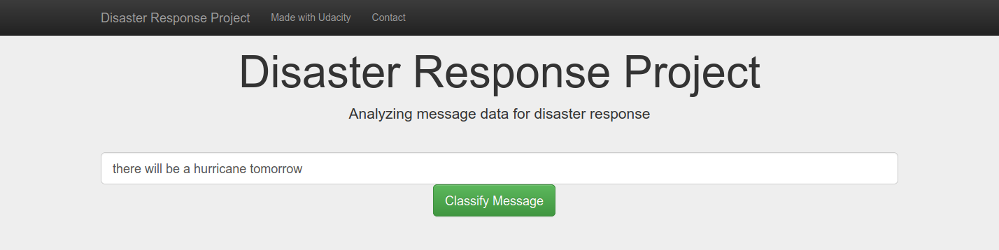
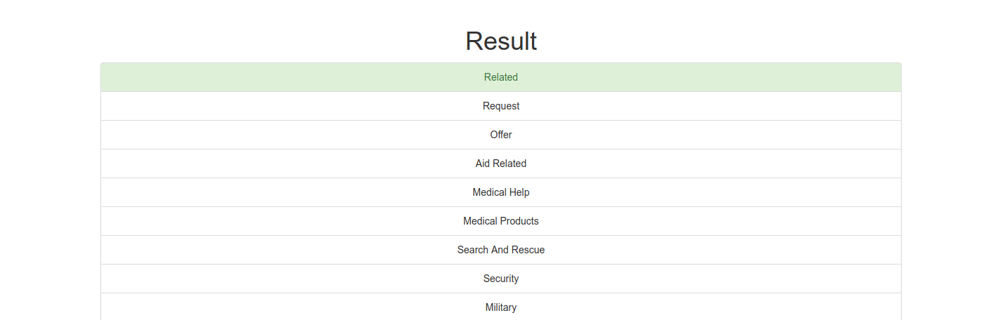
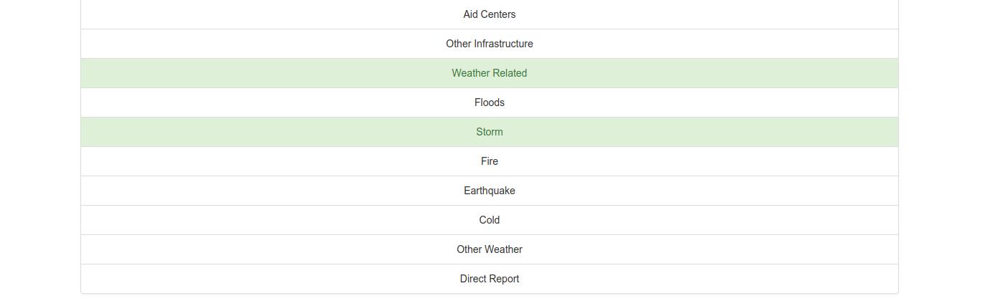

# Introduction
The aim of this project is to categorize messages different disaster categories. An emergency worker can use this web app to classify tweets or texts, and send appropriate aid as needed.

This project is a part of my Udacity's Data Science Nano Degree Program in colaboration with [Figure Eight](https://www.figure-eight.com/). 

The dataset contains messages categorized disasterwise. We clean the dataset, train a model on this clean data and provide a web app to use the model.

## Table of Contents
1. [Installation](#installation)
2. [Usage](#usage)
3. [File Descriptions](#files)
4. [Screenshots](#screenshots)

### Installation 
Please install the following to run the project
* Python version used to make project: 3.8
* Frontend: Flask, Plotly
* Backend: SQLalchemy
* ML and NLP Libraries: SciPy, Pandas, NumPy, Sciki-Learn, NLTK

### Usage 
1. Run the following commands in the project's root directory to set up your database and model.
    - To run ETL pipeline that cleans data and stores in database
        `python data/process_data.py data/disaster_messages.csv data/disaster_categories.csv data/DisasterResponse.db`
    - To run ML pipeline that trains classifier and saves
        `python models/train_classifier.py data/DisasterResponse.db models/classifier.pkl`
2. Run the following command in the app's directory to run your web app.
    `python run.py`
3. Go to http://0.0.0.0:3001/

### File Descriptions 
The three important files of the project include
1. data/process_data.py: This file contains code that extracts dataset from the source, transforms it into usable format and loads it into sqlite format that can be further used for processing.
2. models/train_classifier.py: This file contains code to load clean data, make a model to predict based on the data, and finally saves the model for further usage.
3. app/run.py: Starts the server and loads the web frontend so that model can be accessed by any end user.

### Screenshots
1. Enter the message

2. Press classify and get the results

